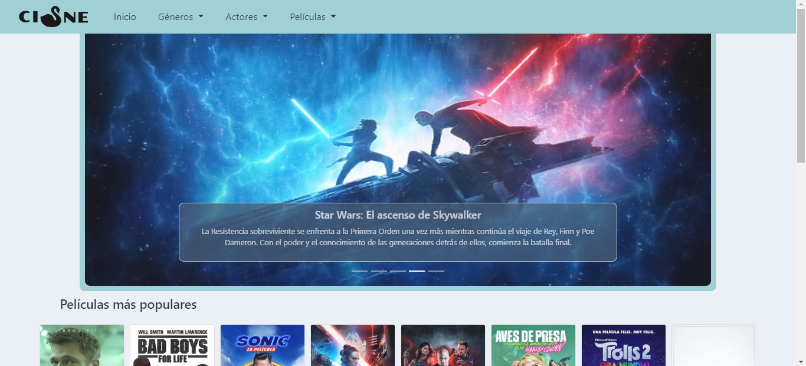
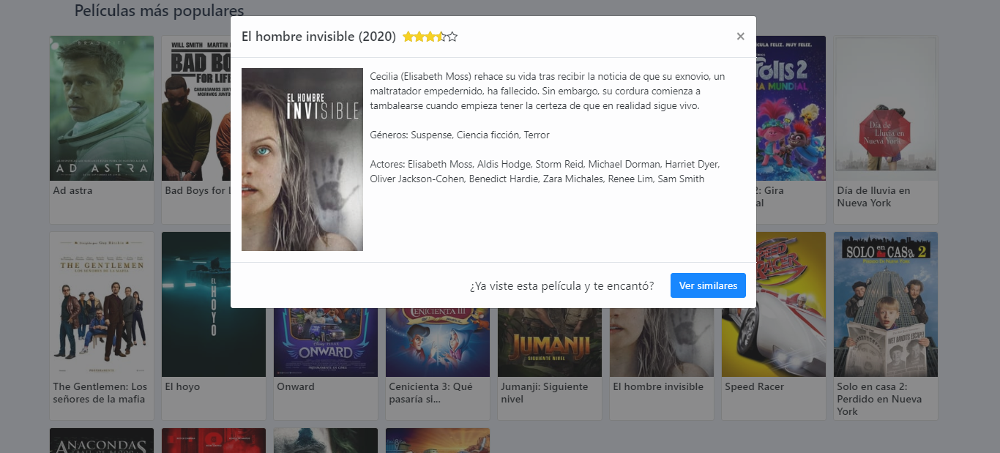
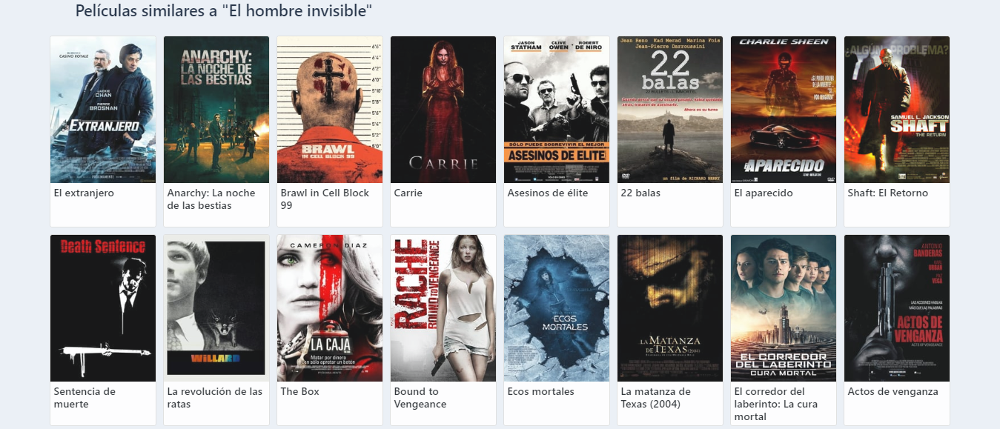
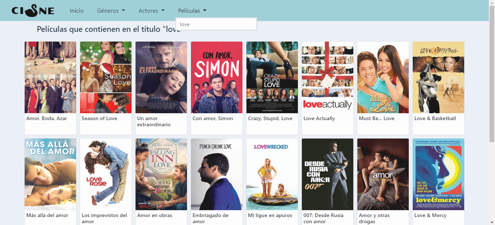
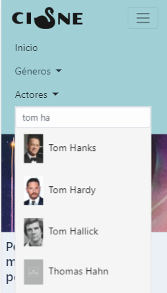

# Cisne

This was my third coding Bootcamp project: a movie finder.

It was made with HTML3, CCS3, Bootstrap, JavaScript & [The Movie DB API](https://developers.themoviedb.org/3).

## Views

### Home

The website design is resposive.

 

### Movie details
 

### Similars movies
 

### Filter by movie name

### Filter by actor
 

You can see the demo here: https://jennifergoijman.github.io/GeeksHubs-P3---Buscador-de-Peliculas/

Made by [Jennifer Goijman](https://github.com/JenniferGoijman)
